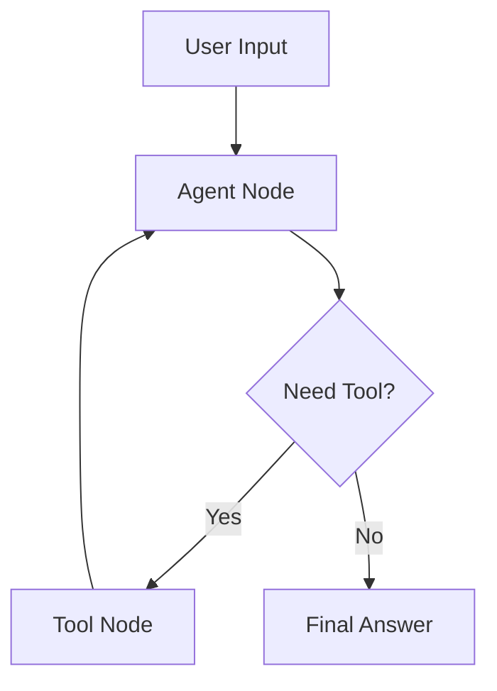

# 04. Single-Agent Workflow

Single-agent systems are the right default for most teams.

That may sound conservative, but it is usually the correct engineering decision. Many production problems that people label as multi-agent are actually better solved by one well-bounded agent, a few deterministic tools, explicit routing, and a review loop.

## What A Single-Agent Workflow Really Means

A single-agent workflow does not mean one giant prompt that does everything. It means one primary decision-maker operating inside a controlled graph.

That workflow may still include:

- classification
- tool calls
- retrieval
- review
- retry logic
- human approval
- checkpointing

The difference is that one agent owns the core reasoning, while the graph controls how work progresses.

## Why This Matters In Real Systems

Single-agent workflows are easier to:

- explain
- test
- observe
- secure
- optimize

They also reduce coordination overhead. Every additional agent introduces more communication, more prompt management, more state passing, and more failure modes.

## A Canonical Single-Agent Flow

This simple flow is often enough for research assistance, support drafting, coding help, internal Q and A, and document workflows.

## State Design For A Single-Agent Workflow

Useful state fields include:

- `user_query`
- `messages`
- `tool_choice`
- `tool_result`
- `needs_tool`
- `draft_answer`
- `final_answer`
- `iteration_count`
- `review_status`
- `last_error`

Why this matters: even a single-agent workflow becomes unstable if state is unclear. The graph still needs to know what happened, what the tool returned, and whether the answer is ready.

## The Role Of The Agent Node

The agent node usually handles one or more of these tasks:

- interpret the request
- decide whether a tool is needed
- use tool results to improve the answer
- draft the next response

The agent node should not silently own every system concern. Timeouts, approval gates, loop counters, and routing policies should still live in the graph design.

## Tool Strategy

Tools should be deterministic where possible.

Examples:

- a calculator
- a structured policy lookup
- a documentation lookup function
- a database query wrapper

Deterministic tools matter because they reduce ambiguity. If a model uses a calculator, the calculator should produce a stable output. If a tool is itself probabilistic, debugging becomes much harder.

## Real Implementation Concerns

### Prompt Design

The prompt should define when the agent should answer directly and when it should request a tool.

### Tool Validation

Validate tool inputs and handle tool failures as first-class outcomes.

### Loop Control

Bound tool-agent loops with `max_iterations`. Do not assume the model will stop correctly.

### Output Shape

Keep a structured answer field or decision field in state. Freeform responses are harder to route on.

## Senior Engineer View

The main question is not whether the agent can call a tool. The main question is whether the workflow remains inspectable after the tool call.

A strong implementation answers these questions:

- which tool was chosen and why
- what arguments were sent
- what result came back
- whether the result was trusted
- whether the answer changed because of the tool

## Architect View

Single-agent workflows are often the best architecture when:

- the task is cohesive
- specialization needs are low
- cost and latency matter
- governance favors simpler execution models
- the system must be understandable by operations and product teams

If one agent plus deterministic tooling can solve the problem, adding more agents usually makes the system worse before it makes it better.

## Research View

The interesting research question is how far a single controlled agent can go before specialization becomes necessary. In many benchmarks, coordination overhead in multi-agent systems cancels out the expected performance gain.

That is why strong single-agent baselines matter.

## Common Failure Modes

### Agent Uses A Tool It Did Not Need

Result: higher latency and cost.

Fix: tighten route policy and compare tool-path vs no-tool-path performance.

### Agent Ignores A Tool It Needed

Result: confident but shallow answer.

Fix: improve prompts, add validation, or insert deterministic pre-routing.

### Tool Output Pollutes Context

Result: noisy state and token waste.

Fix: summarize tool output and keep raw payloads outside prompt-facing history.

### Agent Loops On Tool Use

Result: repeated calls and runaway cost.

Fix: add `max_iterations`, route guards, and explicit completion criteria.

## Production Recommendation

Start with a single-agent graph unless you can prove that specialization adds enough value to justify the extra coordination cost. This is the best default for most production teams because it keeps the system simpler while still allowing routing, checkpoints, retries, review loops, and human approval.

## Related Code

- `examples/03_single_agent_with_tools.py`
- `examples/05_review_loop_graph.py`

Together, these examples show the practical middle ground between a one-shot LLM call and a full multi-agent orchestration system.