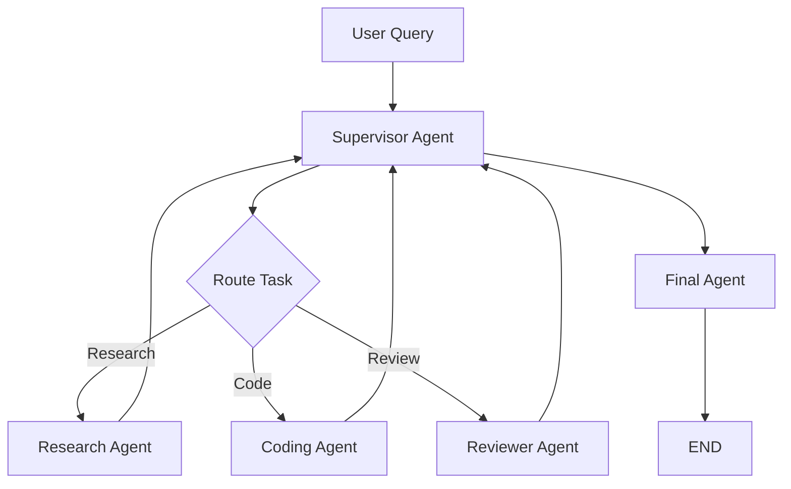

# 05. Multi-Agent Supervisor Pattern

The supervisor pattern is one of the most common ways to organize a multi-agent LangGraph system. One controller decides which specialist should work next, collects intermediate outputs, and decides whether the system is ready to finish.

That sounds clean, and sometimes it is. It is also one of the easiest places to over-engineer a system.

## What The Supervisor Pattern Is

In a supervisor design, the workflow usually looks like this:

1. accept the task
2. let a supervisor inspect state
3. delegate work to a specialist
4. collect the specialist result
5. decide whether to delegate more work, revise, review, or finish

This pattern is useful when specialization is real and the coordination policy matters.

## Why This Matters In Real Systems

The supervisor pattern gives you a central place to control:

- delegation
- policy checks
- completion rules
- escalation
- bounded iteration

This is important when the workflow is too complex for a fixed router, but still needs stronger control than a free-running set of agents.

## Canonical Flow

That diagram matters because it shows the real value of the pattern: the supervisor owns the transition logic.

## A Practical Supervisor Design

For a useful teaching example, this repository uses these roles:

- `supervisor_agent`
- `research_agent`
- `lab_designer_agent`
- `reviewer_agent`
- `final_agent`

Each role should have a narrow job.

### Supervisor Agent

Reads the current state and decides the next step. It should not rewrite the entire answer unless it also owns final synthesis.

### Research Agent

Gathers explanation, evidence, or conceptual grounding.

### Lab Designer Agent

Turns the problem into an actionable design, plan, or implementation outline.

### Reviewer Agent

Checks completeness, coherence, and missing parts. It should return a structured decision, not only a paragraph of opinion.

### Final Agent

Produces the final user-facing answer once the reviewer and supervisor agree the work is ready.

## Clear Responsibility Is Non-Negotiable

Many failed multi-agent systems do not fail because the model is weak. They fail because agents overlap too much.

Bad signs:

- two agents both summarize
- two agents both plan
- reviewer also becomes a writer
- supervisor rewrites outputs instead of routing them

Why this matters in real systems: role overlap causes repetition, token waste, and low-confidence outputs that sound different but add little value.

## State Design For Supervisor Systems

Useful fields include:

- `user_query`
- `research_notes`
- `design_notes`
- `review_notes`
- `next_step`
- `iteration_count`
- `max_iterations`
- `review_status`
- `final_answer`
- `messages`

The key point is that the supervisor should route using structured fields, not vague text blobs.

## Supervisor Vs Router

Use a router when the decision is simple and stable.

Use a supervisor when:

- the next step depends on multiple prior results
- review outcomes affect delegation
- the task can loop through specialists
- completion depends on more than category detection

This distinction matters because many systems use a supervisor when a deterministic router would be cheaper and more reliable.

## Review Loop Integration

A good supervisor system usually includes a reviewer.

The reason is simple: specialization alone does not guarantee completeness. A reviewer gives the workflow a quality gate.

Typical policy:

- if incomplete, route back to research or design
- if complete, route to final synthesis
- if loop count exceeds threshold, stop or escalate

## Max Iterations Is Required

Every supervisor system should carry `max_iterations` or an equivalent budget field.

Without it, you risk:

- infinite loops
- repeated delegation
- review churn
- cost explosion
- latency collapse

The system must know when to stop even if the agents do not.

## Observability Requirements

For each run, record at least:

- which agent was selected at each step
- why the supervisor selected it
- how many loops occurred
- what the reviewer decided
- how long each hop took
- which model was used
- cost and token usage

Without this, supervisor systems become hard to tune and harder to trust.

## Senior Engineer View

The supervisor pattern is mainly an implementation strategy for managing complexity. The challenge is keeping the control policy clearer than the work it coordinates.

If the supervisor prompt becomes a giant instruction dump that tries to do routing, quality judgment, policy enforcement, and summarization at once, the system is drifting toward unmaintainability.

## Architect View

The supervisor is both a coordination mechanism and a potential bottleneck.

Architectural concerns include:

- throughput constraints if every step funnels through one agent
- central failure if supervisor routing is poor
- difficulty testing route quality across many cases
- governance risks if delegation policy is vague

That is why supervisor systems should be justified by clear specialization value.

## Research View

The deeper problem is multi-agent coordination efficiency. The question is not only whether multiple agents can collaborate, but whether their communication adds net value after latency, cost, and context transfer overhead are counted.

This is where research on communication protocols, planning hierarchies, and cost-aware delegation becomes important.

## Production Recommendation

Use the supervisor pattern when there is real specialization and the workflow needs iterative delegation. Do not use it to make a simple workflow look sophisticated. In production, a weak supervisor turns every specialist into noise. A good supervisor makes the system legible, bounded, and easier to govern.

## Related Code

- `examples/04_multi_agent_supervisor.py`

That example demonstrates routing, review, bounded iteration, and final synthesis using a Groq-backed LLM.