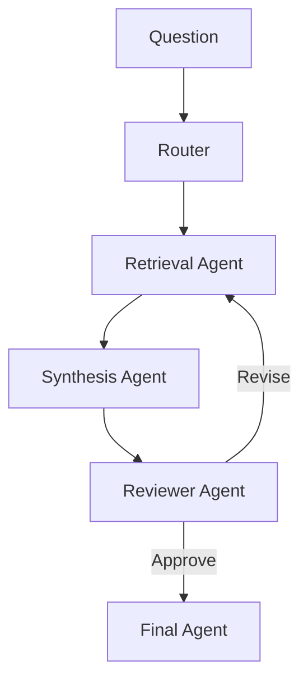
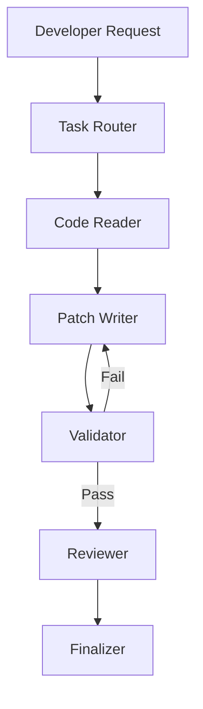
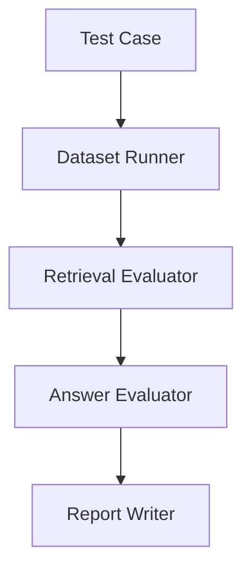
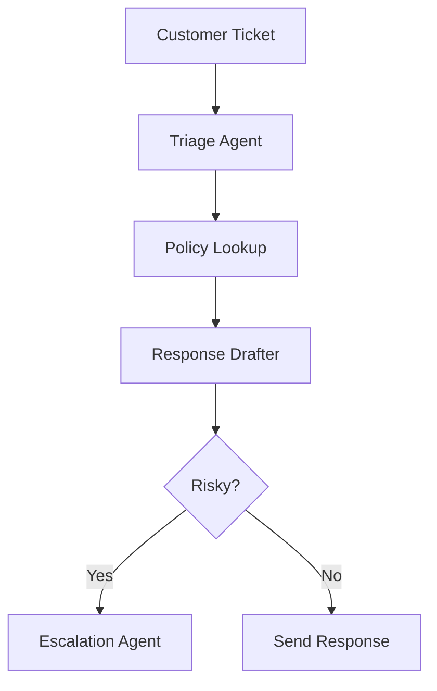
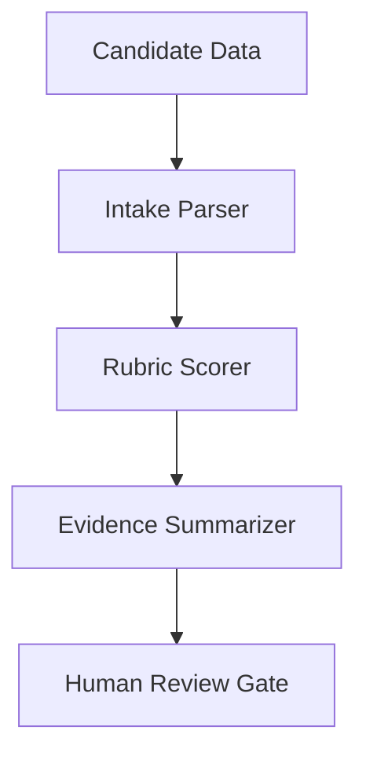
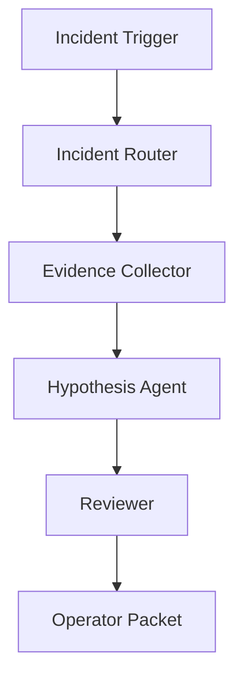
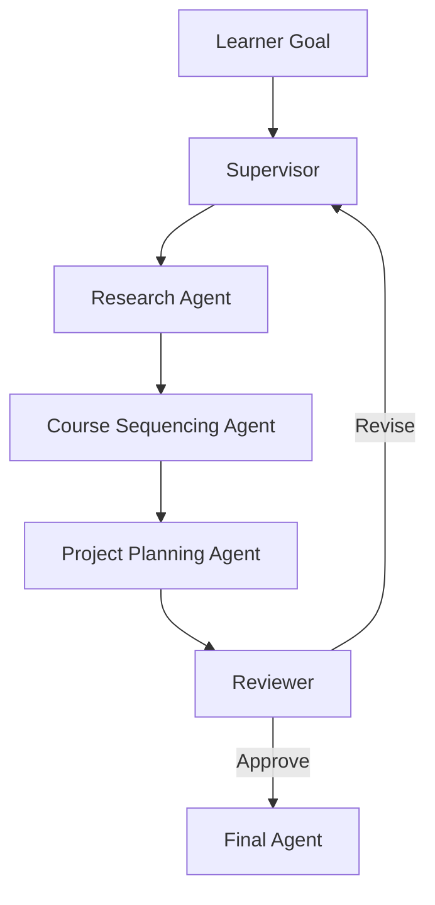

# 07. Architectural Patterns

This document is about system design choices. The central question is not whether LangGraph works. The central question is when it is the right orchestration layer, how much autonomy to allow, and how to structure the surrounding system so the workflow remains reliable.

## When To Use LangGraph

Use LangGraph when the workflow needs explicit state, branching, loops, review, checkpointing, or human approval. It is especially useful when you need to inspect the execution path and reason about how a system arrived at its answer.

Typical good fits:

- research assistants that loop through retrieval and critique
- coding systems that must validate changes before finalizing
- support systems with escalation paths
- approval workflows with pause and resume behavior
- multi-step RAG and evaluation pipelines

## When Not To Use LangGraph

Do not use LangGraph when the task is a short, linear, and stateless interaction. A plain chain or direct model call is often enough for:

- one-shot classification
- short content generation without tools
- simple retrieval plus answer flows with no branching
- prototypes where the workflow is not yet understood

The main architectural error is adding graph complexity before the problem demands graph control.

## Single-Agent Vs Multi-Agent

Single-agent systems are usually better when the task is cohesive and the operational goal is simplicity, lower latency, and easier governance.

Multi-agent systems are justified when specialization is meaningful and each agent contributes distinct value, such as research, planning, review, or domain-specific action.

The engineering rule is simple: start single-agent, prove the baseline, then add agents only where specialization improves measurable outcomes.

## Router Vs Supervisor

Router pattern:

- best for stable, understandable branching
- usually cheaper
- easier to test
- easier to govern

Supervisor pattern:

- best when the next action depends on multiple prior results
- useful for iterative delegation
- more flexible but more expensive
- easier to overuse

This matters because a large fraction of "agentic" systems are really router systems with inflated branding.

## Static Workflow Vs Dynamic Workflow

Static workflows define a mostly known path. They are appropriate when the process is stable and compliance-heavy.

Dynamic workflows allow the path to change based on state, feedback, or model judgment. They are appropriate when the task is open-ended or iterative.

The design question is not which is better in the abstract. It is which one matches the volatility of the task and the operational risk of being wrong.

## Deterministic Code Vs LLM Decision

Use deterministic code for:

- validation
- obvious routing
- schema checks
- permission gates
- timeout handling
- budget enforcement

Use LLM judgment for:

- ambiguous classification
- synthesis
- critique of nuanced text
- handling fuzzy natural-language requests

Good architecture keeps deterministic policy in code and uses the model only where language judgment is genuinely needed.

## Human-In-The-Loop Design

Human approval should appear before irreversible or high-risk actions, not after the system has already done damage.

Useful approval boundaries include:

- external communications
- code changes to protected systems
- user-facing decisions with policy impact
- high-stakes summarization or recommendations

Design the state to carry approval metadata, approver identity, reason codes, and resume behavior.

## Checkpointing Strategy

Checkpointing design should answer these questions:

- when should the workflow be resumable?
- what state must survive a crash or pause?
- what identifiers tie a resumed run to a user or request?
- what store will hold checkpoints in production?

Local memory checkpointing is good for learning. Production systems usually need persistent storage and retention policies.

## State Schema Design

The state schema should be minimal, structured, and route-friendly.

Practical rules:

- keep fields explicit
- separate prompt-facing context from audit data
- include loop counters and approval flags
- avoid unstructured paragraphs for route-critical decisions
- prefer fields that explain operational status directly

## Memory Architecture

Think of memory in three layers:

1. Working state for the current workflow.
2. Session memory for short-lived continuity.
3. Long-term memory or retrieval-backed knowledge for durable recall.

The main design challenge is deciding what enters model context versus what stays in storage until explicitly retrieved.

## Tool Boundary Design

Every tool is an external trust boundary.

Tool design should define:

- input schema
- output schema
- timeout
- retry policy
- idempotency expectations
- logging and trace metadata
- security permissions

The more action a tool can take, the more explicit its boundary should be.

## Evaluation Strategy

Evaluation should cover both outcomes and paths.

Measure:

- route accuracy
- tool usefulness
- reviewer impact
- completion rate
- cost per successful run
- failure class frequency
- human override rate

This is the only way to know whether a more complex graph is actually better than a simpler one.

## Observability And Tracing

At minimum, trace:

- node sequence
- route decisions
- model used
- tool calls
- latency
- cost
- retries
- approval gates
- final status

Tracing is for diagnosis. Logging is for operations and audit. Mature systems usually need both.

## Deployment Architecture

In production, LangGraph typically sits between the frontend or API layer and the operational dependencies.

A common layout includes:

- frontend or API gateway
- LangGraph orchestrator service
- model provider layer
- tool and internal service adapters
- retrieval or vector store layer
- checkpoint store
- observability stack
- evaluation pipeline

The graph is the orchestrator, not the whole platform.

## Practical System Examples

### 1. AI Research Assistant

Use case: answer research-heavy questions by retrieving evidence, synthesizing it, and reviewing the answer for weak claims.

Agents needed: router, retrieval agent, synthesis agent, reviewer agent, final agent.

State fields: `user_query`, `retrieved_sources`, `research_notes`, `review_status`, `final_answer`, `iteration_count`.

Flow diagram:

Failure risks: low-quality retrieval, unsupported synthesis, endless critique loops, and source overload.

Production recommendation: score retrieval quality and keep reviewer criteria explicit.

### 2. AI Coding Assistant

Use case: inspect a repository, draft changes, validate them, and revise if checks fail.

Agents needed: task router, code reader, patch writer, validator, reviewer, finalizer.

State fields: `task_request`, `files_read`, `patch_plan`, `validation_result`, `review_feedback`, `final_patch`, `iteration_count`.

Flow diagram:

Failure risks: editing the wrong files, weak validation, hallucinated fixes, and unbounded rewrite loops.

Production recommendation: keep deterministic validation outside the model and require approval for risky changes.

### 3. RAG Evaluation Workflow

Use case: evaluate whether a retrieval-augmented system is retrieving relevant context and generating grounded answers.

Agents needed: dataset runner, retrieval evaluator, answer evaluator, report writer.

State fields: `test_case`, `retrieved_docs`, `generated_answer`, `relevance_score`, `faithfulness_score`, `report_summary`.

Flow diagram:

Failure risks: evaluator bias, unstable judgment prompts, and missing separation between retrieval quality and answer quality.

Production recommendation: evaluate retrieval and generation separately before combining scores.

### 4. Customer Support Escalation Bot

Use case: triage customer requests, draft responses for simple cases, and escalate risky or policy-heavy cases to humans.

Agents needed: triage agent, policy lookup agent, response drafter, escalation agent, human approver.

State fields: `ticket_text`, `urgency`, `policy_context`, `draft_response`, `risk_flag`, `escalation_status`.

Flow diagram:

Failure risks: wrong urgency classification, policy drift, unsafe direct responses, and poor escalation timing.

Production recommendation: add hard escalation rules for regulated or high-risk ticket classes.

### 5. HR Screening Workflow

Use case: process candidate inputs, score them against role rubrics, and queue decisions for human review.

Agents needed: intake parser, rubric scorer, evidence summarizer, human review gate.

State fields: `candidate_profile`, `role_requirements`, `rubric_scores`, `evidence_summary`, `review_required`, `decision_status`.

Flow diagram:

Failure risks: bias, missing evidence, overconfident summaries, and unauthorized automation of sensitive decisions.

Production recommendation: keep humans in the loop and store justification data for each score.

### 6. LLMOps Incident Analysis Assistant

Use case: summarize an incident, gather evidence from logs and alerts, propose hypotheses, and prepare a review packet for operators.

Agents needed: incident router, evidence collector, hypothesis agent, reviewer, final summarizer.

State fields: `incident_summary`, `alerts`, `logs`, `hypotheses`, `confidence_notes`, `operator_packet`, `severity`.

Flow diagram:

Failure risks: weak evidence grounding, confirmation bias in hypotheses, and unsafe recommendations during live incidents.

Production recommendation: keep the assistant advisory and show explicit evidence for every hypothesis.

### 7. Multi-Agent Course Planner

Use case: help design a course path by combining learner goals, prerequisite analysis, project design, and review.

Agents needed: supervisor, research agent, course-sequencing agent, project-planning agent, reviewer, final agent.

State fields: `learner_goal`, `current_level`, `research_notes`, `course_sequence`, `project_plan`, `review_feedback`, `final_plan`.

Flow diagram:

Failure risks: poor prerequisite modeling, bloated plans, repetitive delegation, and advice that ignores time constraints.

Production recommendation: keep state fields for time budget, prerequisite confidence, and revision count.

## Final Architecture Takeaway

Good LangGraph architecture is not about maximizing agent count. It is about placing control where it belongs. Use deterministic code for hard policy, use models for nuanced judgment, keep state lean, bound loops, make risky actions reviewable, and design the graph as part of a larger production system rather than a standalone demo.