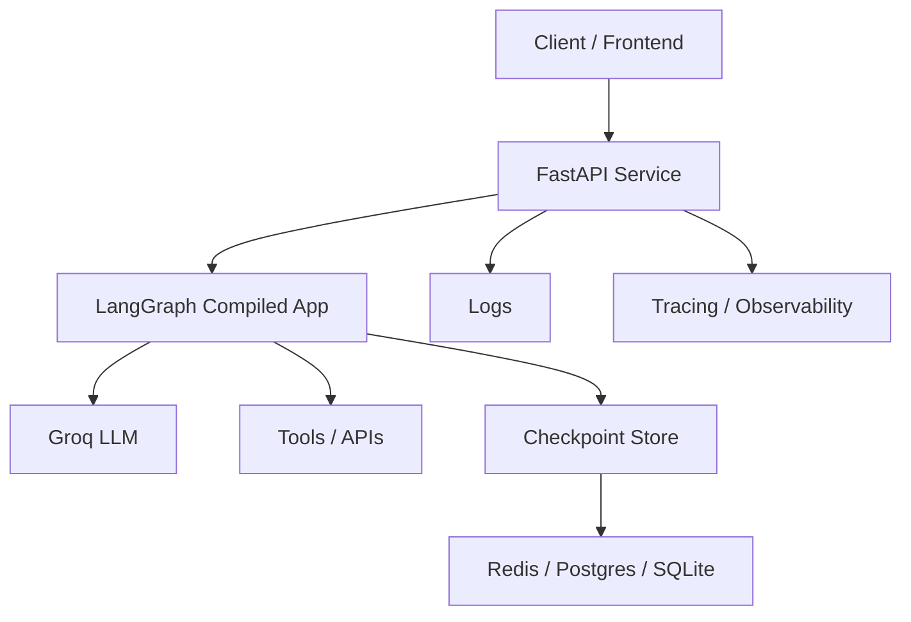

# 10. Deployment and Productionization

LangGraph is useful because it gives you workflow control. That is only the beginning. A LangGraph app should not remain only as a Python script. In production, it usually needs to be wrapped behind an API service, connected to persistent state and checkpoint storage, monitored with logs and traces, protected with timeouts and rate limits, and deployed as a containerized service.

This document explains how to move a LangGraph multi-agent workflow from notebook or script to production API.

## Why Productionization Changes The Problem

In a notebook or one-off script, the main question is whether the workflow runs.

In production, the questions change:

- can requests be validated before they hit the graph?
- can the workflow be interrupted safely?
- can failures be observed and classified?
- can timeouts stop runaway execution?
- can the service survive process restarts?
- can costs be bounded per request?
- can a team deploy, monitor, and roll back the service?

If those questions are not addressed, the system is still a demo, even if the graph logic is strong.

## Deployment Stages

### 1. Local Script Execution

Start here when the goal is correctness and mental models. This is where you validate state design, routing, loop control, and basic outputs.

Use this stage to answer:

- does the graph compile?
- do nodes update state correctly?
- do the routes behave as expected?
- do loop limits actually stop repeated execution?

Recommended command:

```bash
pip install -r requirements.txt
python examples/04_multi_agent_supervisor.py
```

### 2. Local API Using FastAPI

The next step is not a bigger script. It is a service boundary. Wrapping the graph in FastAPI makes the workflow callable by clients, testable through HTTP, and easier to monitor.

This stage should add:

- request validation
- response schema
- health endpoint
- timeout handling
- structured logging
- separation between API layer and graph logic

Recommended command:

```bash
uvicorn deployment.app.api:app --reload --port 8000
```

### 3. Dockerized API

Once the API runs locally, containerize it so the runtime becomes reproducible. This matters because production problems often come from environment drift rather than graph logic.

Recommended command:

```bash
docker build -t langgraph-agent-api .
docker run --env-file .env -p 8000:8000 langgraph-agent-api
```

### 4. Docker Compose Setup

Compose is useful when the service needs supporting infrastructure such as checkpoint storage, reverse proxy, vector DB, or observability services.

Recommended command:

```bash
docker compose up --build
```

### 5. Environment Variable Management

Configuration should come from environment variables, not from code. This is where model name, API keys, max iterations, timeout budgets, and environment mode should live.

### 6. Basic Health Check Endpoint

The health endpoint answers a narrow operational question: is the service process alive and configured enough to serve requests? It should be cheap and deterministic.

### 7. Graph Invocation Endpoint

The invocation endpoint is the public boundary around the graph. It should accept validated inputs and return a structured response rather than raw internal state.

### 8. Logging

Logging should capture request start, request success, timeout, validation failure, and internal errors. These logs matter because the graph path is not enough; operators also need request-level service events.

### 9. Timeout Handling

A graph service should never run without a request timeout. The API must be able to stop or fail a request cleanly when the graph or provider takes too long.

### 10. Error Handling

The service should distinguish input errors, timeout errors, and internal failures. Returning one generic 500 for everything makes operations harder.

### 11. Request Validation

Validation protects the workflow before it spends tokens. Length limits, basic schema validation, and required-field checks should happen at the API boundary.

### 12. Cost-Control Guardrails

Production services need request budgets. Easy first steps include:

- max input size
- max iterations
- capped tool loops
- model selection by route
- logging iterations used per request

### 13. Rate-Limit Considerations

The FastAPI app is not the whole protection story. Rate limiting usually belongs at the gateway, reverse proxy, or API management layer. It still needs to be planned when deploying agent workflows because a few abusive requests can be expensive.

### 14. Checkpoint Persistence

Memory-only checkpointing is fine for learning. Production workflows should use durable storage such as Redis, Postgres, or SQLite-backed persistence depending on scale and recovery needs.

### 15. Observability And Tracing

You need both service-level visibility and graph-level visibility. That means logs at the API layer and traces around nodes, routes, tool calls, retries, and latency.

### 16. Deployment Checklist

Before shipping, review environment setup, secrets, timeouts, iteration limits, validation, fallback policies, checkpoint persistence, logging, tracing, and rollback readiness.

## Deployment Architecture



This diagram matters because it shows that the graph is one component inside a deployable system. Production reliability depends on the whole path, not only on node logic.

## The Example FastAPI Service In This Repository

The deployment package included in this repository uses three layers:

- `deployment/app/config.py` for configuration through environment variables.
- `deployment/app/graph_service.py` for graph build and run logic.
- `deployment/app/api.py` for HTTP endpoints, validation, timeouts, and logging.

That separation matters because API concerns and workflow concerns should not be tangled together.

## Sample Commands

### Local Run

```bash
pip install -r requirements.txt
python examples/04_multi_agent_supervisor.py
```

### FastAPI Run

```bash
uvicorn deployment.app.api:app --reload --port 8000
```

### Docker Build

```bash
docker build -t langgraph-agent-api .
```

### Docker Run

```bash
docker run --env-file .env -p 8000:8000 langgraph-agent-api
```

### Docker Compose

```bash
docker compose up --build
```

### API Test

```bash
curl -X POST http://localhost:8000/invoke \
  -H "Content-Type: application/json" \
  -d '{"query":"Create a LangGraph class plan with labs"}'
```

## Production Checklist Table

| Area | Question | Recommendation |
| --- | --- | --- |
| Environment variables | Are model names, timeouts, and budgets configured outside code? | Load them through environment variables and validate them at startup. |
| Secrets | Are API keys hardcoded or committed? | Keep secrets in `.env`, secret managers, or deployment platform settings. |
| API timeout | Can a request run forever? | Enforce request-level timeout budgets in the API layer. |
| Max iterations | Can the graph delegate forever? | Set and log max iteration limits. |
| Input validation | Can malformed or oversized inputs hit the graph? | Validate request schema and input size at the API boundary. |
| Output schema | Are responses predictable for clients? | Return typed, structured responses instead of raw graph state. |
| Retry policy | Are transient failures retried intentionally? | Retry only where failures are likely to be temporary. |
| Tool failure handling | What happens when a tool call fails? | Classify, log, and route tool failures explicitly. |
| Checkpoint storage | Can workflow state survive restarts? | Use persistent checkpoint storage in production. |
| Logging | Can operators reconstruct request outcomes? | Log request start, finish, timeout, validation error, and internal failure. |
| Tracing | Can engineers inspect the workflow path? | Trace nodes, routes, tool calls, retries, and latency. |
| Rate limiting | Can abusive traffic exhaust spend? | Apply rate limits at the API gateway or reverse proxy. |
| Cost tracking | Do you know what each workflow costs? | Track model usage, iteration count, and path-level cost. |
| Human approval | Are risky actions gated? | Add explicit approval checkpoints before irreversible actions. |
| Testing graph paths | Are non-happy paths validated? | Test route branches, loop exits, and fallback behavior. |
| Docker image size | Is the runtime larger than needed? | Use slim base images and avoid unnecessary build dependencies. |
| CI/CD | Is deployment manual and error-prone? | Add automated build, lint, test, and release checks. |
| Rollback plan | Can you revert a bad deployment quickly? | Keep tagged images and a rollback procedure ready before shipping. |

## What Should Not Be Done

- Do not deploy notebook code directly.
- Do not hardcode API keys.
- Do not allow unlimited graph loops.
- Do not keep checkpoints only in memory for production.
- Do not expose raw internal state to users.
- Do not call tools without validation.
- Do not skip logging and tracing.
- Do not use one giant agent for every task.

These mistakes matter because they are exactly how promising internal demos become unstable external systems.

## Guidance By Experience Level

### Developers Deploying Their First Agent API

Focus on clean separation: config, graph service, API layer. Add validation, timeout handling, and a health check before you think about scale.

### Senior Engineers Designing Production Reliability

Focus on failure classification, retry rules, persistent checkpointing, logging strategy, response contracts, and bounded cost behavior.

### Architects Thinking About Scaling, Durability, Governance, And Observability

Focus on service boundaries, checkpoint storage, API gateway protections, rollout and rollback, compliance, auditability, and how graph traces fit into broader platform telemetry.

## Final Teaching Summary

The key lesson is that a LangGraph workflow becomes production-ready only when it is treated as a service, not just as a script. The graph solves orchestration. The API, configuration, timeout strategy, logging, tracing, checkpoint persistence, and deployment model make that orchestration operable in the real world.