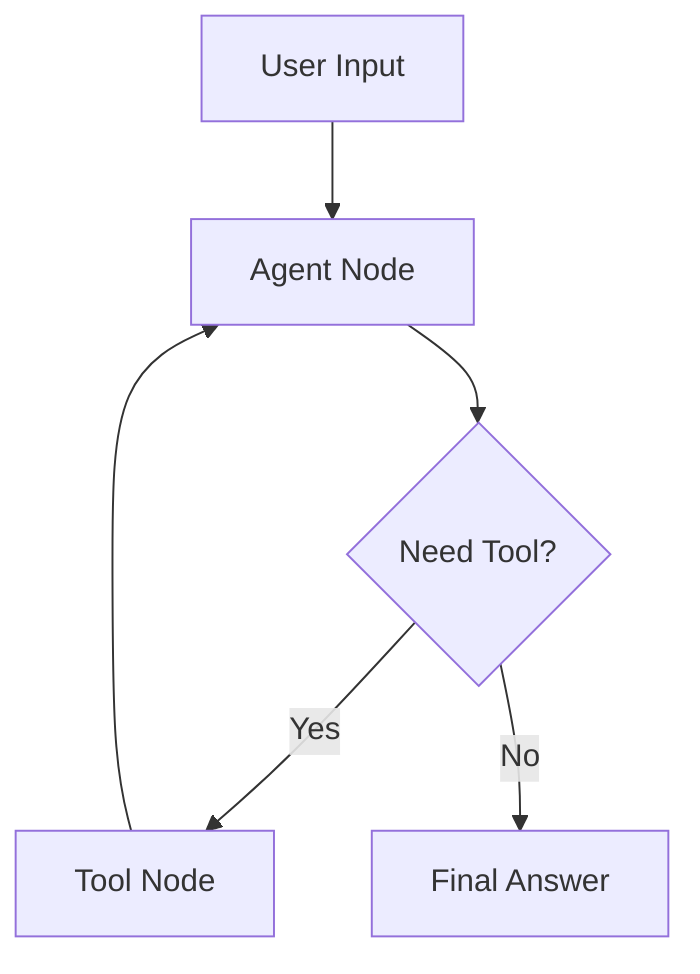

# LangGraph Basic Flow

This is the smallest useful mental model for LangGraph. A user request enters the workflow, an agent decides whether it has enough information, and a tool loop runs only when needed.

## Why This Matters

- It shows that a graph is about controlled execution, not just calling a model.
- It keeps tool usage explicit.
- It demonstrates a bounded loop pattern that can later gain retries, review, and checkpointing.