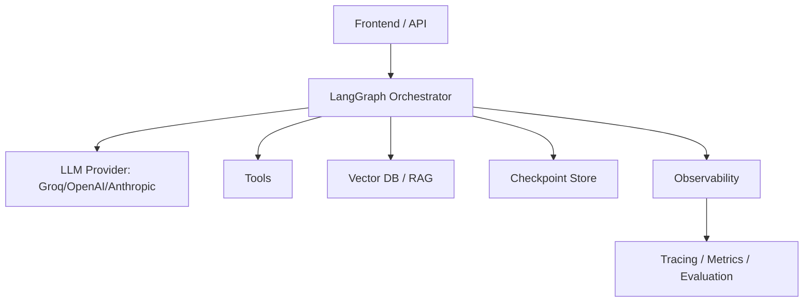

# Production Architecture Flow

This diagram shows LangGraph as the orchestration layer inside a broader production system. The graph is not the whole application. It is the control layer that coordinates models, tools, data, durability, and observability.

## Why This Matters

- It places LangGraph in the system where it belongs: orchestration, not everything.
- It shows that durable execution needs external stores and observability.
- It reinforces that production agent systems are software systems, not just prompts.