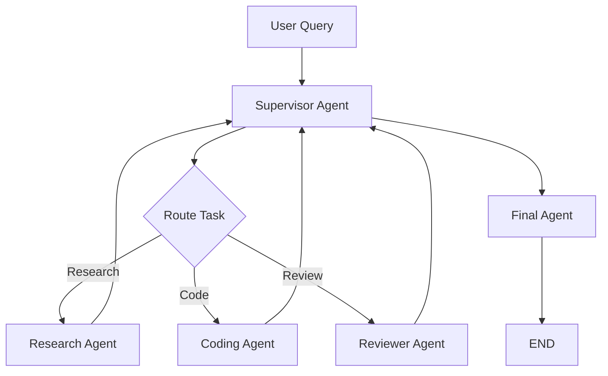

# Supervisor Pattern Flow

This diagram shows a classic supervisor-driven multi-agent workflow. One controller routes work to specialists and decides when the system is ready to finalize.

## Why This Matters

- It makes delegation explicit.
- It shows how specialists can loop back through a controller.
- It highlights where bottlenecks and governance concerns usually appear.